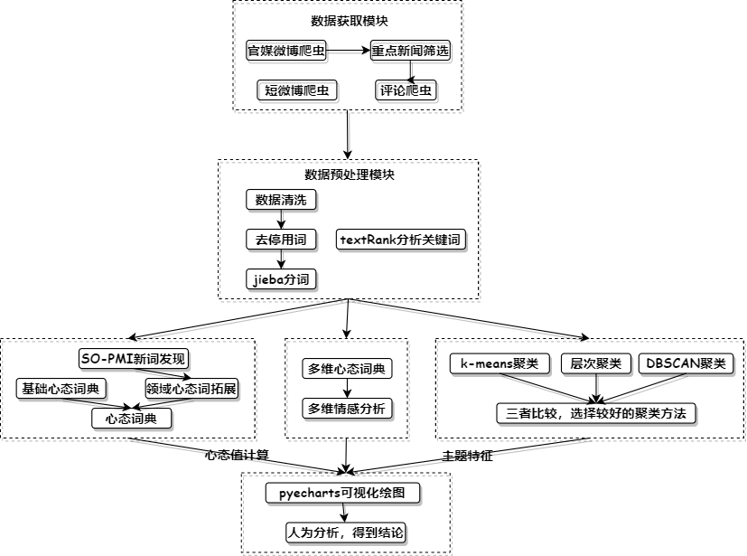
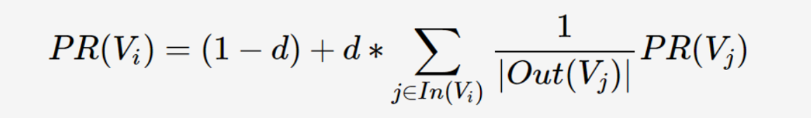
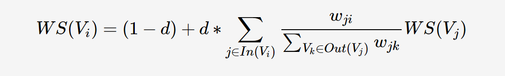
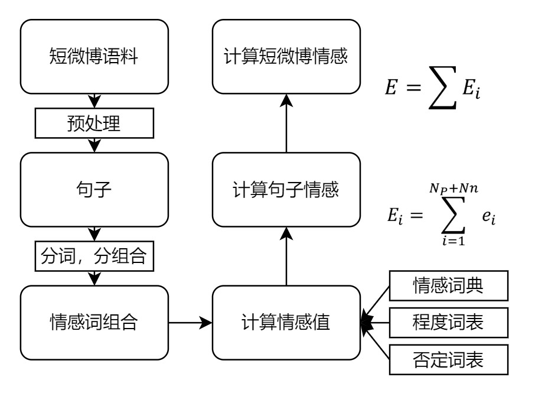
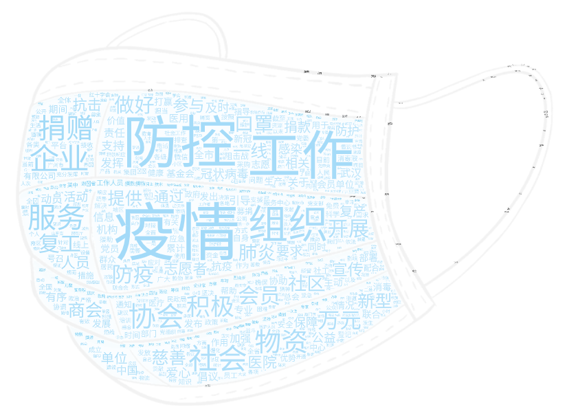

# COVID-19背景下基于微博文本的网络心态分析


## 	1.  摘要

​		微博作为一种快速便捷的信息传播载体，在疫情阶段发挥着重要的信息传输作用。本次作业的目的就是深入分析疫情信息中蕴含的网民情绪及其变化情况。以新冠肺炎疫情相关的短微博和相关新闻下的评论作为主要研究对象，利用心态词典方法可以大致观察心态演变，使用拓展的多维心态词典分析不同阶段主要事件下的网民心态极性，并结合层次聚类法从中抽取网民关注热点，最后通过可视化方法展现相应的结果。结果TODO

​		**关键词**：微博；疫情；情感分析；心态词典；层次聚类；数据可视化

## 	2. 前言

### 2.1.研究背景

疫情：新冠肺炎病毒于2020年1月大规模爆发，虽然现代医疗科技发展迅速，但人类依然无法避免类似的大规模突发性公共卫生事件的困扰，可能在未来的很长一段时间内，大型传染性疾病依然无法彻底消除，人类将与病毒进行长期的抗争。突发卫生事件的突然性和危害性、新冠病毒的感染数和致死率等严重影响公众群体的正常心态，一种疫情下独特的网络社会心态就此形成，因此我们希望借助一些数据计量方法准确客观的了解公众群体的网络社会心态及其变化规律，并对未来的突发卫生事件产生积极意义。

微博：自疫情爆发以来，以微博为代表的社交媒体上广泛的传播各种疫情信息，用户发布的疫情相关短文本可以使用官方搜索引擎获取；此外，代表着官方媒体的央视新闻和人民日报等账号号通过微博发布了大量的疫情信息，同时微博的评论功能使得网友可以发表自己对于新闻的看法，这为我们数据分析提供了必要的数据源支持。

情感分析：情感分析是对带有情感色彩的主观性文本进行分析和推理的过程，其主要分析方法有机器学习方法和心态词典方法，本次作业主要使用心态词典及其相关联信息分析情感。

心态词典：心态词典法是最简单也是最符合直觉的方法，其核心是通过判断特定的关键字是否出现在文本中从而给文本确定情感倾向性。基于情感词典法主要将情感词表和人工制定的相关规则结合。这里面最主要的一个问题就是无法解决未录入词表词的问题，尤其是很多包含情感倾向性的新兴网络词汇，导致最后结果的召回率偏低。本次作业将重点考虑这部分的词语，以求得更高的准确率。

基于情感字典的具体做法是，用己有的人工标注的情感词典去査找一个文本中包含正向情感词汇和负向情感词汇的总分数，根据以下公式计算情感分数并判断情感极性和情感强烈程度。


此公式中的Score代表情感分数，x<sub>i</sub>表示每个词语对应在情感词典里的分数值，而E表示对于分数值的权重处理，这部分将在下面有详细的介绍。而利用Score的正负情况可以得到情感的极性，Score的数值大小可以得到情感的强烈程度。


关注热点：最能体现一段文本的热点信息就是关键词，本文实现了比较常用的textRank算法，能较好的完成提取关键信息的任务，此外，聚类是另一个提取热点的方法，它是根据目标文本的特征对其进行分类的方法，其结果能减少减少对象的类数，使得我们能够快速获取想要的文本热点。具体的聚类方法包括K-means算法，DBSCAN密度聚类和层次聚类等。

### 2.2. 研究~~

## 3. 研究方法

我们研究工作的目的是希望得到疫情期间网络公众群体的心态，具体的研究可以细化为两个部分，一是分析疫情期间不同时间段的用户情感极性和情感强烈程度，二是分析突发公共卫生事件下不同阶段公众信息的主题特征。

本作业的主要工作首先就是从网上抓取能代表网民心态的信息，然后要对这些信息进行初步的分类和预处理，之后使用三种技术对数据进行分析。我们使用心态词典研究情感极性和情感强度，使用拓展过的多维情感词典对于文本进行多维情感分类，并利用聚类算法分析主题特征，最后利用可视化绘图技术总结分析得到结论。详细的分析见下面的内容，主要涵盖的内容如下图。




### 3.1. 数据获取

#### 3.1.1. 数据源选择

本次作业希望得到能代表网民情感的数据，最初我想到了QQ空间和微信朋友圈的内容，但从可行性的角度上这较难实现；其次可以是抖音、b站相关疫情视频上的弹幕或评论，但随着我们深入了解，发现这部分的数据收视频内容影响严重，许多弹幕存在重复的现象，并不利于我们的进一步分析；我们还考虑过京东、淘宝等电商应用内相关防疫物品(口罩，消毒工具和食品)下的评价和购买量，但经过调研我们发现疫情期间在售的商品普遍都已经下架，现在在架的商品评价均在2020年4月以后，这也不符合我们的需求。

所以本次数据采用新浪微博（简称微博）里的数据，微博是一种被大众广泛使用的社交平台，其信息传播快，更新速度快，信息类型远多于其他平台。在微博上，网民不仅可以接收信息，还可以可以自己发布自己的文本，也可以到其他人的微博下进行评论或转发，甚至很多情况下有人使用微博来传递重要信息或者处理应急事件，中国社会科学院社会学研究所在2020年发布的一项调查报告显示，75%以上的中国网民曾使用过微博来了解疫情相关信息，所以我们选择微博进行分析。

#### 3.1.2. 数据爬取

具体而言，我们需要的数据是2020年1月20日到2020年5月的疫情相关短微博和同时间下某些重点微博下的相关评论，总之就是单条微博的数据和微博下的评论数据。微博的网页端weibo.cn是几个微博接口中最好的选择，提供了我们需要的搜索功能，我就可以借助它来查询特定时间和特定关键词的微博文本。爬虫的主要内容是先在浏览器中请求微博，然后对于得到的内容进行解析。

##### 3.1.2.1. 请求

请求部分使用`requests`库，目标是微博网页端搜索的`url`，为了能够保证在请求时不用登陆，可以在请求的同时传入`Cookie`，因为要搜索特定时间和特定关键词的微博，所以在请求时还要传入关键词和时间，排序方法要按照时间排序。传入的关键词是疫情相关的随机关键词，我找到了约50个疫情相关的词语，包括积极词，中性词和消极词，并利用`random`模块随机生成数字下标，进行随机抽取关键词搜索，以求得到的数据能代表当天的网民主流心态。部分关键代码解释如下：

```python
import requests
url = 'https://weibo.cn/search/mblog' # 网页端微博搜索url
headers = {
    'Cookie': '自己的Cookie',
    'User-Agent': UserAgent().random  # fake_useragent库
}
params = {
    'keyword': self.keyword,          # 随机关键词
    'endtime': self.end_time,		  # 传入搜索时间，精确到小时，所以爬虫以小时为单位
    'sort': 'time',					  # 依据时间对微博进行排序
}
res = requests.get(url=url, params=params, headers=headers) # 仅展示部分代码
```

##### 3.1.2.2. 解析

解析部分使用lxml库，详见具体代码解读。

```python
from lxml import etree
# 使用etree对html进行解析
html = etree.HTML(res.text.encode('utf-8'))
# 在请求时page从1开始，weibos即每页的微博列表
# 等到len(weibos)==0就说明微博为空，此时停止即可
# 我们也不需要太多的文本，每个时间单位爬取大约十页内容即可
weibos = html.xpath("//div[@class='c' and @id]")
```

下面来解析`weibos`中的每个元素中微博id和微博发布者

``` python
# 对于该微博id的获取
# 利用xpath抽取id属性，体现为@id，后9位是该微博的id号
weibo['id'] = info.xpath('@id')[0]  # M_ItwJTv2Xg
weibo['id'] = weibo['id'][2:]		# ItwJTv2Xg
# 对该微博发布者进行爬取
user_info = html.xpath('//div[@class="ut"]/span[@class="ctt"]')[0]
# 例如'男神优衣裤 男/广东 加关注'
# '男神优衣裤' '男' '广东' '加关注' 分别是姓名，性别，省份，简介
# 发布者关注：关注[190]
following = html.xpath('//div[@class="tip2"]/a[1]/text()')[0]
# 发布者粉丝：粉丝[28031]
followd = html.xpath('//div[@class="tip2"]/a[2]/text()')[0]
```

解析正文

```python
# 把所有标签中的文本(包括嵌套)提取出来,并且放到一个字符串中
weibo_content = html.xpath('string(.)')
# 例如：'无悔无花:我刚刚关注了肺炎患者求助超话，抗击肺炎疫情，我们在一起，共同关注→肺炎患者求助  赞[0] 转发[0] 评论[0] 收藏 2020-02-10 10:59:58 来自超话'
# 然后截取所有 '赞' 之前的内容就是正文
weibo_content = weibo_content[:weibo_content.rfind(u'赞')]
# 包括发布微博的具体时间和来自设备都基于此
# 微博的点赞，转发和评论数自然也是如此，就不详述了，可见代码
```

解析完所有的数据后，要把每一条微博写入csv文件

``` python
result_headers = ['微博id', '发布者昵称', '发布者性别', '发布者地区', '发布者关注数', '发布者粉丝数', '微博正文', '发布时间', '点赞数', '转发数','评论数', ]
result_data = [w.values() for w in self.weibo][wrote_num:]
with open('topic/' + 'some keyWords' + str(mystart_day) + '.csv', 'a', encoding='utf-8-sig',
          newline='') as f:
    writer = csv.writer(f)
    global boo
    if boo:
        # 第一次要写表头，后序不用写了
        boo = False
        writer.writerows([result_headers])
        writer.writerows(result_data)
```

##### 3.1.2.3.  防反爬虫

由于微博平台有着严格的反爬虫策略，经常会被封号，所以我也采取了一些措施来防反爬虫。首先是自己设置了`user-agent`，利用`from fake_useragent`中的`UserAgent().random`来生成随机的`user-agent`，且每次爬虫完毕都会暂停随机几毫秒，来防止速度过快:`sleep(random.randint(6, 10))`，并且我使用了ip全局代理来通过不同ip进行访问，防止ip被封。

##### 3.1.2.4. 爬虫结果

我爬取了疫情期间2020年1月23日至2020年5月21日共计50MB数据，这些数据基于随机抽取的疫情关键词，且微博发布时间在每天都是随机且均匀的，然而可以看到微博中依然有很多并非网民发布的微博，这部分需要在后序进行筛选。数据总量在8-10万条。此外我还爬取了某些重点新闻下的评论，这几部分都作为我后序数据分析的数据源


### 2. 数据预处理

#### 3.2.1. 数据清洗

首先来看段示例文本。

```python
示例：'回复@让我再看你一眼 //让我再看你一眼·:#高以翔[超话]# 以翔 这个点了睡意全无  节日现在对于我们就是一种悲伤  没有了你世界都乱了 新冠肺炎疫情爆发让多少家庭除夕夜不能团聚  如果你在肯定会教我们正确的心态对待 会为逆行英雄打call 会做慈善捐助  因为你是Godfrey@高以翔Godfrey @全世界最好的高以翔Godfrey 仙桃  显示地图 原图http://t.cn/Ir1YpaAb0'
```

发现微博正文中有很多特殊字符，而且有很多格式是我们不需要的。例如微博中的@，这个表示微博和某人相关来给其一个提示，但是@后跟着的是用户昵称，这与文本内容无关，所以我们需要将其清洗掉。另外微博中含有很多表情符，例如`[微笑]`，感觉现代表情的含义是非常之丰富和复杂的，但绝大多数表情是为文本内容服务的，起到一个加强文本预期的作用，所以我可以将其处理掉，来减少后序任务的复杂性。剩余的例如网址、特殊字等请看下面的代码详解。

```python
# 清除用户名(:前的用户名)
for i in range(len(text)):
    if text[i] == ':' or text[i] == '：':
        text = text[i + 1:-1]
        break
        
# 清除网址url
zh_puncts1 = "，；、。！？（）《》【】"
URL_REGEX = re.compile(
            r'(?i)((?:https?://|www\d{0,3}[.]|[a-z0-9.\-]+[.][a-z]{2,4}/)(?:[^\s()<>' + zh_puncts1 + ']+|\(([^\s()<>]+|(\([^\s()<>]+\)))*\))+(?:\(([^\s()<>]+|(\([^\s()<>]+\)))*\)|[^\s`!()\[\]{};:\'".,<>?«»“”‘’' + zh_puncts1 + ']))',
            re.IGNORECASE)
text = re.sub(URL_REGEX, "", text)

# 清除@和回复/转发中的用户名
text = re.sub(r"(回复)?(//)?\s*@\S*?\s*(:|：| |$)", " ", text) 

# 清除中括号包着的表情符号
text = re.sub(r"\[\S+?\]", "", text)

# 清除话题内容
text = re.sub(r"#\S+#", "", text)  

# 清除多个空格
text = re.sub(r"(\s)+", r"\1", text)

# 清除常见停用词标中的词，例如：展开、全文、转发、显示原图、原图 等等
for x in stop_terms:
    text = text.replace(x, "")
   
# 清除前后空格
text = text.strip()
```

对上述示例进行应用，可以得到以下结果。

```python
原文:'回复@让我再看你一眼·//让我再看你一眼·:#高以翔[超话]# 以翔 这个点了睡意全无  节日现在对于我们就是一种悲伤  没有了你世界都乱了 新冠肺炎疫情爆发让多少家庭除夕夜不能团聚  如果你在肯定会教我们正确的心态对待 会为逆行英雄打call 会做慈善捐助  因为你是Godfrey@高以翔Godfrey @全世界最好的高以翔Godfrey 仙桃 显示地图 原图 http://t.cn/Ir1YpaAb0'

清洗结果：'以翔 这个点了睡意全无 节日现在对于我们就是一种悲伤 没有了你世界都乱了 新冠肺炎疫情爆发让多少家庭除夕夜不能团聚 如果你在肯定会教我们正确的心态对待 会为逆行英雄打call 会做慈善捐助 因为你是Godfrey 仙桃'
```

#### 3.2.2. 去停用词和分词

停用词表我使用的是一份开源的中文停用词表，分词使用`jieba`分词的精确模式，对于一些未登录词，结巴采用了基于汉字成词能力的隐马尔可夫模型，使用了维特比算法，能更好的处理微博文本中的一小部分网络词汇。

```python
jieba.cut(line, cut_all=False, HMM=True)
```

#### 3.2.3. textRank关键词提取

textRank算法基于pageRank算法的思想，首先来介绍一下pageRank。它用于计算网页的重要性，认为网页的重要性由两部分组成，一是被链接网页的数量，二是被链接网页的权重，计算公式如下：



PR(V<sub>i</sub>)表示第i个网页重要性值即PR值，d是一个阻尼系数，可以设置为0.85，In(V<sub>i</sub>)表示对第i个有出链的网页集合，Out(V<sub>j</sub>)表示第j个网页的出链网页数。初始时设置所有网页排名相同，然后加以迭代，平稳后即得结果。


textRank算法是对pageRank算法的改进，它将文本拆分为词汇组成词汇网，利用局部词汇(即窗口)的关系，对词语排序。可以从下面的textRank计算公式看出，相比于pageRank，其算法仅仅加入了权重W<sub>ji</sub>来标志词间重要程度不同。



算法实现时，先将文本进行分词、去停用词等预处理步骤，还可以对词性进行筛选，只保留特定的词性。然后开始构建关键词图，利用共现关系构造两点之间的边，如果其在长度为`k`的窗口中同时出现则认为两点间存在边，然后依据上述公式进行迭代直至收敛，最后就会得到个词的权重，进行排序即可获知关键词。

核心代码展示

```python
#首先对文本进行清洗，分词和去除停用词
text = clean_text(text)
jieba.cut(text,HMM=True)
if (word not in stopwords) and (len(word) > 1):l.append(word)
#然后将每个文本清洗后的结果l放入block_words，传入textRank，可得结果
kwds = textRank(block_words, 5, boo)

def textRank(block_words, topK, with_score=False):
    G = nx.Graph()
    for word_list in block_words:
        for u, v in combine(word_list, 2):
            G.add_edge(u, v)
    pr = nx.pagerank_scipy(G)
    pr_sorted = sorted(pr.items(), key=lambda x: x[1], reverse=True)
    if with_score:
        return pr_sorted[:topK]
    else:
        return [w for (w, imp) in pr_sorted[:topK]]
    
def combine(word_list, window=2):
    for x in range(1, window):
        if x >= len(word_list):
            break
        word_list2 = word_list[x:]
        res = zip(word_list, word_list2)
        for r in res:
            yield r
            
# 效果展示
原文：'2月9日凌晨1点40分，我县接到紧急通知，需要再增派5名相关医务人员，赴湖北支援新冠肺炎救治工作。驰援号角再次吹响！8时便确定了上报名单。中午12时15分，安吉5名医务人员仅在十小时内，安排好工作，安抚好家人，完成集结，整装出发！他们分别是县人民医院黄志辉、县中医院邱蔚晨和周海月、安吉二院叶苑、安吉三院王志英，作为浙江省第三批抗击新冠肺炎紧急医疗队成员驰援湖北。此前，我县已有县人民医院汪学丽、罗玉红2名医务人员驰援武汉'
前十个关键词：['安吉', '驰援', '医务人员', '医院', '工作', '湖北', '新冠', '肺炎', '接到', '紧急通知']
```


### 3. 数据分析

#### 3.3.1. 情绪词典

##### 3.3.1.1. SO-PMI新词发现

##### 3.3.1.2. 情感计算

情感计算需要准备情感词表，否定词和程词表，情感计算规则


情感类型和强度方面，本作业采用了[Boson情感词典](https://bosonnlp.com/dev/resource)，并基于上述SO-PMI算法对原有词典进行了补充，将发现的新词按强度值为1拓展了原有词典。下面展示一些示例，

```
积极词示例：
    爽朗 2.1359760295
    大步 2.13600542481
    欢声笑语 2.15198331531
    喜报 3.03301490396
消极示例：
    住嘴 -1.58328814932
    惨淡 -1.57775898103
    忧心忡忡 -1.59476173694
    恶性 -1.59597143208
```


程度词部分，本次作业使用知网程度词表，我们人工也对其进行了简化，选取了较多的日常程度副词，按程度大致分为四个等级，并对每个等级赋予了相应的程度权值，具体内容如下。

|         级别          |        示例词语        | 权重 |
| :-------------------: | :--------------------: | :--: |
| 极 extreme \| 最 most | 极度、极端、绝对、完全 |  4   |
|        很 very        | 多么、分外、格外、很是 |  3   |
|  更 more \| 较 more   | 更加、较为、愈发、越是 |  2   |
|        稍 -ish        | 稍微、稍稍、略微、一点 |  1   |


否定词部分，本次作业采用知网否定词表，在这里不用展示了。


我们还需要考虑情感词和否定词，程度词的组合情况，当只有情感词在组合中起到了情感表达作用时，则只需要考虑情感词的情感；当否定词和情感词共同在组合中起到了情感表达作用，如“不满意”则表示与“满意”相反的情感；当程度副词和情感词共同在组合中起到了情感表达作用时，程度词对情感词有一个加强的作用；当否定词、程度副词及情感词共同在组合中起到了情感表达作用，我们只需要将其分开考虑；当程度副词、否定词及情感词共同在组合中起到了情感表达作用，我们认为效果和之前一种情况类似；最后，多个否定词及情感词共同在组合中起到了情感表达作用则每有一个否定词就否定一重情感值即可。综上，这些情感组合模式已经涵盖了大部分的规则，具体如下：e表示情感值结果，P表示情感词对应的情感值，A表示程度副词程度值。

| 序号 |           类型           |      结果       |
| :--: | :----------------------: | :-------------: |
|  1   |       只含有情感词       |      e = P      |
|  2   |     否定词 + 情感词      |  e = (-1) * P   |
|  3   |     程度词 + 情感词      |    e = A * P    |
|  4   | 否定词 + 程度词 + 情感词 | e= (-1) * A * P |
|  5   | 否定词 + 否定词 + 情感词 |      e = P      |
|  6   | 程度词 + 否定词 + 情感词 | e = (-1) * A* P |

对于一个句子来说，e<sub>i</sub>表示每个情感词组合的情感值，N<sub>p</sub>+N<sub>n</sub>表示正向情感词组合数和负向情感词组合数之和，E<sub>i</sub>表示每个句子的情感值，E就是整个短文本微博的情感值。


算法的具体流程图如下，后三步就主要是累加的过程：



核心代码解释：

```python
# 核心循环如下
# 首先对短文本数据清洗，分句分词
datafen_dist = sent2word(d)
# 为了减少下一步操作的复杂性，先将词的种类区分
data_1 = classifyWords(datafen_dist, words_vaule[0], words_vaule[1], words_vaule[2])
# 计算情感值，在这个函数中计算了组合的情感值，句子的情感值并将它们累加
data_2 = scoreSent(data_1[0], data_1[1], data_1[2],returnsegResult(data[0]))
# 保存
score_var.append(data_2)
```

效果示例：

```python
'她不讲道理:疫情夹杂着雨水 气氛变得诡异 大年三十好像 红火的难过着我真的好害怕…… '     
情感值：-2.4441889162743

'i狸追:#疫情地图##全国确诊新型肺炎病例# 我求求你们了，别乱跑了行么，现在被你们折腾的全国都沦陷了'  
情感值：-5.678527271838299

'回复@不知名的微博z:看到您们的评论笑死我了，哈哈哈'
情感值：5.2873025592616
```

#### 3.3.2. 多维情感分析


#### 3.3.3. 热点分析

##### 3.3.3.1. Agglomerative层次聚类

层次聚类是一种常见的聚类算法，将不同类别数据间的相似度构建一颗有层次的嵌套聚类树，聚类树中不同类别的原始数据是树的最底层，而顶层自然是结果`cluster`，层次聚类的后面一次结果都贪心的基于前一层的结果，这里主要介绍自底向上的层次聚类，不断的合并最终会生成一个簇。

树形图一般用以直观表示层次聚类成果，纵坐标高度表示不同簇之间的距离，为了得到某个聚类结果，可以使任一条竖直线对其切割，即可获得对应的聚类结果。实现中我们基于上文完成的textRank算法计算出每个短微博文本的前20个关键词，然后基于`scikit-Learn`中的向量化器对其进行向量化和`fit`，然后调用其提供的`AgglomerativeClustering`进行聚类，衡量距离的方法选择常用的`'ward'`，其余可用的还有`'single'`、 `'complete'` 、`'average'`、 `'weighted'`、 `'centroid'`、 `'median'`，之后生成相应的效果树状图。下面的图片是对本次爬取的实验示例数据的一个测试：


为了确定不同聚类数对效果的影响，我分别对其计算了**轮廓系数（Silhouette Coefficient）**，**CH分数（Calinski Harabasz Score ）**和**戴维森堡丁指数(DBI，davies_bouldin_score）**，这三个无标签评价函数是常见的分析聚类效果的函数，具体的分析在本小节的第四部分，暂时可以先看一下结果。可以从下图看出，DBI指数在聚类数设置为3或6时较低，CH值在2或3时较高，轮廓系数较为明显，呈现先增加后减少的趋势，总之聚类数选3比较适宜。


```python
# 核心代码解释
# 首先读取关键词文件，此关键词文件基于上步textRank算法生成
text = open('key.txt', encoding='utf-8').read()
list1 = text.split("\n")
# 调用sklearn的相关向量化器和聚类器
count_vec = CountVectorizer(min_df=3)
xx1 = count_vec.fit_transform(list1).toarray()
ac = AgglomerativeClustering(n_clusters=num, affinity='euclidean', linkage='ward')
labels = ac.fit_predict(xx1)
# 使用matplotlib对树状图进行初步的可视化展示
plt.scatter(xx1[:, 0], xx1[:, 1], c=labels)
plt.show()
```


##### 3.3.3.2. K-means聚类

K-means算法是一种基于划分的聚类算法，他必须传入一个参数`k`作为簇的个数，然后将数据对象划分，是的簇内相似度较高，簇间相似度较低，其基本思想是根据给定的数据，先随机选择`k`个数据作为簇中心，然后根据剩余数据与簇心的距离将它赋给最进的簇心，并重新计算每个簇中对象距离均值重新确定簇心，几次迭代后函数就趋近于收敛，即簇心不再明显变化。

K-means聚类算法保证了局部最优，但是很明显，他的缺点在于需要认为的设定`k`值，这个值对聚类效果的影响很大，不同的值得到的结果不同，且根据定义来看，此种聚类方法对于异常值和样本分类不均衡的分类效果不友好，因为我们需要确定簇数设定为多少时效果最好，下图是`k`分别取2，3，5时的聚类效果，可以看出`k`取2时分类效果较好。


下图是`k`取不同值时的三种评价函数值，可以看出`k=2`时轮廓系数最大，DBI值最小，k适合取2。


```python
# 核心代码讲解
# 首先读文件
filepath = 'sample_data.csv'
df = pd.read_csv(filepath, index_col=0, )
# 对文件进行预处理，包括使用上文的clean_text函数对文本进行清洗，包括简单的筛选词性和jieba分词，利用停用词表对文本去停用词
preProcess(df)
# 简单的去重
word_library_list = list(set(flat((df['content_cut']))))
# 使用sklearn提供的矢量化器对文本进行矢量化，首先计算适合的特征词数
single_frequency_words_list = get_single_frequency_words(df['content_cut'])
max_features = (len(word_library_list) - len(single_frequency_words_list))
matrix = feature_extraction(df['content_'], vectorizer='TfidfVectorizer',
                            vec_args={'max_df': 0.95, 'min_df': 1, 'max_features': max_features})
# 使用sklearn提供的聚类器聚类
kmeans = KMeans(n_clusters=2, random_state=9).fit(matrix)
# 计算聚类三种评价函数
score = metrics.calinski_harabasz_score(matrix.toarray(), kmeans.labels_)
print(score)
print(metrics.silhouette_score(matrix.toarray(), kmeans.labels_))  
print(metrics.davies_bouldin_score(matrix.toarray(), kmeans.labels_))
# 对聚类结果降维和可视化
labels = kmeans.labels_
df['label'] = labels
df['matrix'] = matrix.toarray().tolist()
df_non_outliers = df[df['label'] != -1].copy()
data_pca_tsne = feature_reduction(df_non_outliers['matrix'].tolist(), pca_n_components=3, tsne_n_components=2)
# 使用matplotlib对降维结果可视化
plt.figure()
x = [i[0] for i in data_pca_tsne]
y = [i[1] for i in data_pca_tsne]
plt.scatter(x, y, c=label)
```


##### 3.3.3.3. DBSCAN密度聚类

`DBSCAN`算法是一种基于密度的聚类算法，它在聚类前不需要预先指定簇的个数，所以最终簇的个数也不确定，它认为样本数据点的周围的数据点同属一类，即将紧密相连的样本划分为一类，就得到了一个个簇。此类算法需要不断的调整参数`eps`以求得最好的效果，发现DBI值呈明显上升趋势，而CH值和轮廓系数效果不明显，所以DBSCAN聚类算法参数`eps`暂取0.01。


```python
# 核心代码讲解
# 前几步与k-means步骤类似
filepath = 'sample_data.csv'
df = pd.read_csv(filepath, index_col=0, )
preProcess(df)
word_library_list = list(set(flat((df['content_cut']))))
# 使用sklearn提供的矢量化器对文本进行矢量化，首先计算适合的特征词数
single_frequency_words_list = get_single_frequency_words(df['content_cut'])
max_features = (len(word_library_list) - len(single_frequency_words_list))
matrix = feature_extraction(df['content_'], vectorizer='TfidfVectorizer',vec_args={'max_df': 0.95, 'min_df': 1, 'max_features': max_features})
# 使用sklearn提供的聚类器聚类，使用DBSCAN聚类器
dbscan = DBSCAN(eps=eps_var, min_samples=min_samples_var, metric='cosine').fit(matrix)
# 计算聚类三种评价函数
score = metrics.calinski_harabasz_score(matrix.toarray(), dbscan.labels_)
print(score)
print(metrics.silhouette_score(matrix.toarray(), dbscan.labels_))  
print(metrics.davies_bouldin_score(matrix.toarray(), dbscan.labels_))
# 下面步骤与kmeans类似
labels = dbscan.labels_
df['label'] = labels
df['matrix'] = matrix.toarray().tolist()
df_non_outliers = df[df['label'] != -1].copy()
data_pca_tsne = feature_reduction(df_non_outliers['matrix'].tolist(), pca_n_components=3, tsne_n_components=2)
plt.figure()
x = [i[0] for i in data_pca_tsne]
y = [i[1] for i in data_pca_tsne]
plt.scatter(x, y, c=label)
```


##### 3.3.3.4. 三种聚类评价函数

**轮廓系数(Silhouette Coefficient)**，是聚类效果好坏的一种评价方式。它结合内聚度和分离度两种因素。可以用来在相同原始数据的基础上用来评价不同算法、或者算法不同运行方式对聚类结果所产生的影响。根据每个样本到其他同簇样本距离生成一个簇内不相似度，再由此产生一个s<sub>i</sub>来代表具体样本聚类好坏程度，s<sub>i</sub>接近1，则说明样本i聚类合理；s<sub>i</sub>接近-1，则说明样本i更应该分类到另外的簇；若s<sub>i</sub> 近似为0，则说明样本i在两个簇的边界上，求所有的s<sub>i</sub>再取均值就是轮廓系数。

```python
# 调用sklearn的接口来计算
score2 = metrics.silhouette_score(matrix.toarray(), labels_)
```

**CH值(Calinski Harabasz Score)**，CH值依据簇间色散平均值和群内色散间和来确定，簇内的协方差越小，簇间的协方差越大时，聚类效果较好，且CH值越大。

```python
# 调用sklearn的接口来计算
metrics.calinski_harabasz_score(matrix.toarray(), labels_)
```

**戴维森堡丁指数(davies_bouldin_score)**，简称DBI，这也是个常见的评价聚类效果好坏的值，DBI的最小值为0，值越小代表效果越好。

```python
# 调用sklearn的接口来计算
metrics.davies_bouldin_score(matrix.toarray(), labels_)
```


选择上述三种聚类方法进行横向对比，相应的参数则尽可能选择效果更好的。从下面的图标可以看出层次聚类的轮廓系数更接近1，CH也更大，明显更适合做微博样本的聚类方法。

|    聚类方法\评价函数     | 轮廓系数 |  CH值  |  DBI  |
| :----------------------: | :------: | :----: | :---: |
|   **K-means( k = 2 )**   |  0.067   | 95.22  | 1.940 |
| **DBSCAN( eps = 0.01 )** |  0.122   | 15.96  | 0.988 |
|    **层次( k = 3 )**     |  0.426   | 153.78 | 1.905 |

### 4. 数据可视化

本次作业数据可视化部分主要使用`pyecharts`库，还有一部分使用`matplotlib`，具体的应用详见图片即可。

## 4. 案例

### 4.1. 微博爬虫

经过很多天的爬虫，我们最终获取到了从2020年1月20日到2020年5月20日的疫情相关短微博共约8万条，大小50MB左右，截图展示如下


除此之外，为了方便下面的关键事件分析，我还专门爬取了几个特定时间和关键词的文本，包括`1月20日 '人传人'`、`1月23日 '封城'`、`2月7日 '李文亮'`、`2月10日 '对口支援'`、`3月10日 '复工复产'`。为了研究新闻对评论影响这个部分，我还爬取了50多条央视新闻微博号下的共计上千条评论，具体的内容都在相应的文件夹下。

但是我们的数据也存在一定的问题，虽然说上面我们完成了`clean_text()`能够很好的对数据进行清洗，然而由于微博搜索引擎的问题，我们爬取到的微博有很大一部分并非是用户发布，我们认为一些官方号、官媒号微博不能代表网民的心态和情绪，所以再后序进行操作时，我们根据`发布者粉丝`这一项对粉丝数大于一万的微博进行了剔除，尽可能的保证所有的微博都来自于网民而不是其他。

### 4.2. 关键词提取

基于textRank关键词提取算法，我们提取了很多关键词，主要也给下一步按层次聚类提供了更改好的数据支撑，除此之外，还制作了如下的词云。




### 4.3. 数据分析

#### 4.3.1. 心态值计算


#### 4.3.2. 多维心态分析

#### 4.3.3. 热点聚类分析

## 5. 结论

## 6. 反思与不足

## 7. 参考文献

## 8. 附录

### 小组成员

| 职务 |  姓名  |   学号    |            邮箱            |
| :--: | :----: | :-------: | :------------------------: |
| 队长 | 关昕宇 | 191840077 | 191840077@smail.nju.edu.cn |
| 队员 | 孙宁言 | 191250125 | 191250125@smail.nju.edu.cn |
| 队员 | 蒲中正 | 191250113 | 191250113@smail.nju.edu.cn |

