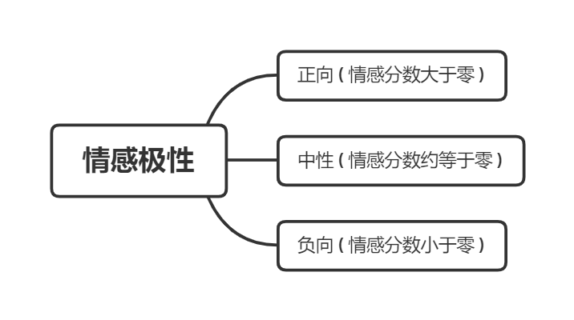
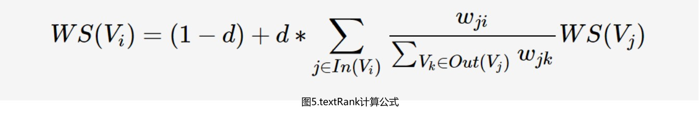
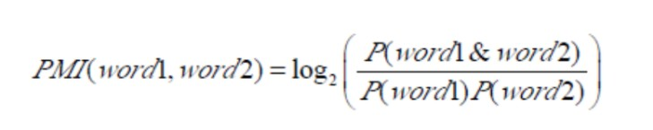
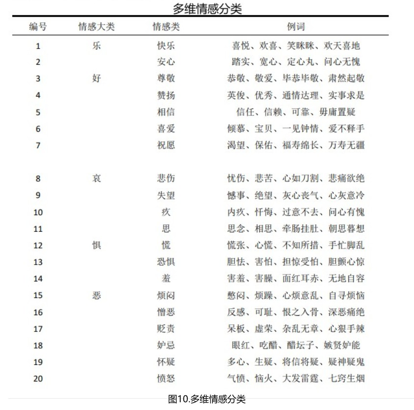
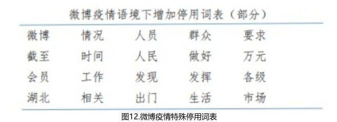
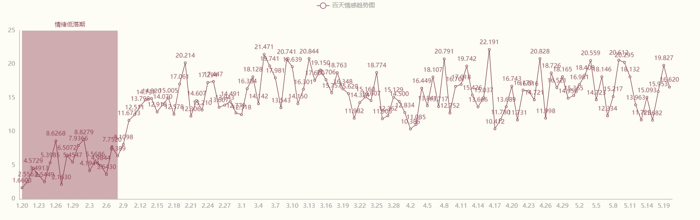
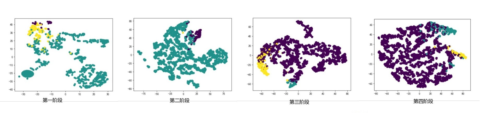

# COVID-19背景基于微博文本的网络心态分析


> <font size =4>**Github地址：https://github.com/Gxy-2001/DataScienceAssignment**</font>


[toc]


## 	1.  摘要

​		微博作为一种快速便捷的信息传播载体，在疫情阶段发挥着重要的信息传输作用。本次作业的目的就是深入分析疫情信息中蕴含的网民情绪及其变化情况。以新冠肺炎疫情相关的短微博和相关新闻下的评论作为主要研究对象，利用心态词典方法可以大致观察心态演变，使用拓展的多维心态词典分析不同阶段主要事件下的网民心态极性，并结合层次聚类法从中抽取网民关注热点，最后通过可视化方法展现相应的结果。对于疫情的四大阶段和其中典型事件都进行了数据分析，在典型事件分析部分得到了较好的结果。

​		**关键词**：微博；疫情；情感分析；心态词典；层次聚类；数据可视化

## 	2. 前言

### 2.1.研究背景

​		新冠肺炎病毒于2020年1月大规模爆发，虽然现代医疗科技发展迅速，但人类依然无法避免类似的大规模突发性公共卫生事件的困扰，可能在未来的很长一段时间内，大型传染性疾病依然无法彻底消除，人类将与病毒进行长期的抗争。突发卫生事件的突然性和危害性、新冠病毒的感染数和致死率等严重影响公众群体的正常心态，一种疫情下独特的网络社会心态就此形成，因此我们希望借助一些数据计量方法准确客观的了解公众群体的网络社会心态及其变化规律，并对未来的突发卫生事件产生积极意义。

​		自疫情爆发以来，以微博为代表的社交媒体上广泛的传播各种疫情信息，用户发布的疫情相关短文本可以使用官方搜索引擎获取；此外，代表着官方媒体的央视新闻和人民日报等账号号通过微博发布了大量的疫情信息，同时微博的评论功能使得网友可以发表自己对于新闻的看法，这为我们数据分析提供了必要的数据源支持。

​		情感分析是对带有情感色彩的主观性文本进行分析和推理的过程，其主要分析方法有机器学习方法和心态词典方法，本次作业主要使用心态词典及其相关联信息分析情感。

​		心态词典法是最简单也是最符合直觉的方法，其核心是通过判断特定的关键字是否出现在文本中从而给文本确定情感倾向性。基于情感词典法主要将情感词表和人工制定的相关规则结合。这里面最主要的一个问题就是无法解决未录入词表词的问题，尤其是很多包含情感倾向性的新兴网络词汇，导致最后结果的召回率偏低。本次作业将重点考虑这部分的词语，以求得更高的准确率。

​		基于情感字典的具体做法是，用己有的人工标注的情感词典去査找一个文本中包含正向情感词汇和负向情感词汇的总分数，根据以下公式计算情感分数并判断情感极性和情感强烈程度。


​		此公式中的Score代表情感分数，x<sub>i</sub>表示每个词语对应在情感词典里的分数值，而E表示对于分数值的权重处理，这部分将在下面有详细的介绍。而利用Score的正负情况可以得到情感的极性，Score的数值大小可以得到情感的强烈程度。



<center> <font size=1>图2.情感极性判断</font></center>


​		最能体现一段文本的热点信息就是关键词，本文实现了比较常用的textRank算法，能较好的完成提取关键信息的任务，此外，聚类是另一个提取热点的方法，它是根据目标文本的特征对其进行分类的方法，其结果能减少减少对象的类数，使得我们能够快速获取想要的文本热点。具体的聚类方法包括K-means算法，DBSCAN密度聚类和层次聚类等。


## 3. 研究方法

​		我们研究工作的目的是希望得到疫情期间网络公众群体的心态，具体的研究可以细化为两个部分，一是分析疫情期间不同时间段的用户情感极性和情感强烈程度，二是分析突发公共卫生事件下不同阶段公众信息的主题特征。

​		本作业的主要工作首先就是从网上抓取能代表网民心态的信息，然后要对这些信息进行初步的分类和预处理，之后使用三种技术对数据进行分析。我们使用心态词典研究情感极性和情感强度，使用拓展过的多维情感词典对于文本进行多维情感分类，并利用聚类算法分析主题特征，最后利用可视化绘图技术总结分析得到结论。详细的分析见下面的内容，主要涵盖的内容如下图。


### 3.1. 数据获取

#### 3.1.1. 数据源选择

​		本次作业希望得到能代表网民情感的数据，最初我想到了QQ空间和微信朋友圈的内容，但从可行性的角度上这较难实现；其次可以是抖音、b站相关疫情视频上的弹幕或评论，但随着我们深入了解，发现这部分的数据收视频内容影响严重，许多弹幕存在重复的现象，并不利于我们的进一步分析；我们还考虑过京东、淘宝等电商应用内相关防疫物品(口罩，消毒工具和食品)下的评价和购买量，但经过调研我们发现疫情期间在售的商品普遍都已经下架，现在在架的商品评价均在2020年4月以后，这也不符合我们的需求。

​		所以本次数据采用新浪微博（简称微博）里的数据，微博是一种被大众广泛使用的社交平台，其信息传播快，更新速度快，信息类型远多于其他平台。在微博上，网民不仅可以接收信息，还可以可以自己发布自己的文本，也可以到其他人的微博下进行评论或转发，甚至很多情况下有人使用微博来传递重要信息或者处理应急事件，中国社会科学院社会学研究所在2020年发布的一项调查报告显示，75%以上的中国网民曾使用过微博来了解疫情相关信息，所以我们选择微博进行分析。

#### 3.1.2. 数据爬取

​		具体而言，我们需要的数据是2020年1月20日到2020年5月的疫情相关短微博和同时间下某些重点微博下的相关评论，且重点是疫情相关随机关键词搜索下的微博正文，因为我的想法是微博评论的内容会受正文影响，且评论的文本普遍短小，不能体现疫情下网民心态，只能体现网民对新闻所陈述事件的看法，所以我们这个项目爬的数据以短微博文本为主。微博的网页端weibo.cn是几个微博接口中最好的选择，提供了我们需要的搜索功能，我就可以借助它来查询特定时间和特定关键词的微博文本。爬虫的主要内容是先在浏览器中请求微博，然后对于得到的内容进行解析。

##### 3.1.2.1. 请求

​		请求部分使用`requests`库，目标是微博网页端搜索的`url`，为了能够保证在请求时不用登陆，可以在请求的同时传入`Cookie`，因为要搜索特定时间和特定关键词的微博，所以在请求时还要传入关键词和时间，排序方法要按照时间排序。传入的关键词是疫情相关的随机关键词，我找到了约50个疫情相关的词语，包括积极词，中性词和消极词，并利用`random`模块随机生成数字下标，进行随机抽取关键词搜索，以求得到的数据能代表当天的网民主流心态。部分关键代码解释如下：

```python
import requests
url = 'https://weibo.cn/search/mblog' # 网页端微博搜索url
headers = {
    'Cookie': '自己的Cookie',
    'User-Agent': UserAgent().random  # fake_useragent库
}
params = {
    'keyword': self.keyword,          # 随机关键词
    'endtime': self.end_time,		  # 传入搜索时间，精确到小时，所以爬虫以小时为单位
    'sort': 'time',					  # 依据时间对微博进行排序
}
res = requests.get(url=url, params=params, headers=headers) # 仅展示部分代码
```

##### 3.1.2.2. 解析

​		解析部分使用lxml库，详见具体代码解读。

```python
from lxml import etree
# 使用etree对html进行解析
html = etree.HTML(res.text.encode('utf-8'))
# 在请求时page从1开始，weibos即每页的微博列表
# 等到len(weibos)==0就说明微博为空，此时停止即可
# 我们也不需要太多的文本，每个时间单位爬取大约十页内容即可
weibos = html.xpath("//div[@class='c' and @id]")
```

​		下面来解析`weibos`中的每个元素中微博id和微博发布者

``` python
# 对于该微博id的获取
# 利用xpath抽取id属性，体现为@id，后9位是该微博的id号
weibo['id'] = info.xpath('@id')[0]  # M_ItwJTv2Xg
weibo['id'] = weibo['id'][2:]		# ItwJTv2Xg
# 对该微博发布者进行爬取
user_info = html.xpath('//div[@class="ut"]/span[@class="ctt"]')[0]
# 例如'男神优衣裤 男/广东 加关注'
# '男神优衣裤' '男' '广东' '加关注' 分别是姓名，性别，省份，简介
# 发布者关注：关注[190]
following = html.xpath('//div[@class="tip2"]/a[1]/text()')[0]
# 发布者粉丝：粉丝[28031]
followd = html.xpath('//div[@class="tip2"]/a[2]/text()')[0]
```

​		解析正文

```python
# 把所有标签中的文本(包括嵌套)提取出来,并且放到一个字符串中
weibo_content = html.xpath('string(.)')
# 例如：'无悔无花:我刚刚关注了肺炎患者求助超话，抗击肺炎疫情，我们在一起，共同关注→肺炎患者求助  赞[0] 转发[0] 评论[0] 收藏 2020-02-10 10:59:58 来自超话'
# 然后截取所有 '赞' 之前的内容就是正文
weibo_content = weibo_content[:weibo_content.rfind(u'赞')]
# 包括发布微博的具体时间和来自设备都基于此
# 微博的点赞，转发和评论数自然也是如此，就不详述了，可见代码
```

​		解析完所有的数据后，要把每一条微博写入csv文件

``` python
result_headers = ['微博id', '发布者昵称', '发布者性别', '发布者地区', '发布者关注数', '发布者粉丝数', '微博正文', '发布时间', '点赞数', '转发数','评论数', ]
result_data = [w.values() for w in self.weibo][wrote_num:]
with open('topic/' + 'some keyWords' + str(mystart_day) + '.csv', 'a', encoding='utf-8-sig',
          newline='') as f:
    writer = csv.writer(f)
    global boo
    if boo:
        # 第一次要写表头，后序不用写了
        boo = False
        writer.writerows([result_headers])
        writer.writerows(result_data)
```

##### 3.1.2.3.  防反爬虫

​		由于微博平台有着严格的反爬虫策略，经常会被封号，所以我也采取了一些措施来防反爬虫。首先是自己设置了`user-agent`，利用`from fake_useragent`中的`UserAgent().random`来生成随机的`user-agent`，且每次爬虫完毕都会暂停随机几毫秒，来防止速度过快:`sleep(random.randint(6, 10))`，并且我使用了ip全局代理来通过不同ip进行访问，防止ip被封。


### 2. 数据预处理

#### 3.2.1. 数据清洗

​		首先来看段示例文本。

```python
示例：'回复@让我再看你一眼 //让我再看你一眼·:#高以翔[超话]# 以翔 这个点了睡意全无  节日现在对于我们就是一种悲伤  没有了你世界都乱了 新冠肺炎疫情爆发让多少家庭除夕夜不能团聚  如果你在肯定会教我们正确的心态对待 会为逆行英雄打call 会做慈善捐助  因为你是Godfrey@高以翔Godfrey @全世界最好的高以翔Godfrey 仙桃  显示地图 原图http://t.cn/Ir1YpaAb0'
```

​		发现微博正文中有很多特殊字符，而且有很多格式是我们不需要的。例如微博中的@，这个表示微博和某人相关来给其一个提示，但是@后跟着的是用户昵称，这与文本内容无关，所以我们需要将其清洗掉。另外微博中含有很多表情符，例如`[微笑]`，感觉现代表情的含义是非常之丰富和复杂的，但绝大多数表情是为文本内容服务的，起到一个加强文本预期的作用，所以我可以将其处理掉，来减少后序任务的复杂性。剩余的例如网址、特殊字等请看下面的代码详解。

```python
# 清除用户名(:前的用户名)
for i in range(len(text)):
    if text[i] == ':' or text[i] == '：':
        text = text[i + 1:-1]
        break
        
# 清除网址url
zh_puncts1 = "，；、。！？（）《》【】"
URL_REGEX = re.compile(
            r'(?i)((?:https?://|www\d{0,3}[.]|[a-z0-9.\-]+[.][a-z]{2,4}/)(?:[^\s()<>' + zh_puncts1 + ']+|\(([^\s()<>]+|(\([^\s()<>]+\)))*\))+(?:\(([^\s()<>]+|(\([^\s()<>]+\)))*\)|[^\s`!()\[\]{};:\'".,<>?«»“”‘’' + zh_puncts1 + ']))',
            re.IGNORECASE)
text = re.sub(URL_REGEX, "", text)

# 清除@和回复/转发中的用户名
text = re.sub(r"(回复)?(//)?\s*@\S*?\s*(:|：| |$)", " ", text) 

# 清除中括号包着的表情符号
text = re.sub(r"\[\S+?\]", "", text)

# 清除话题内容
text = re.sub(r"#\S+#", "", text)  

# 清除多个空格
text = re.sub(r"(\s)+", r"\1", text)

# 清除常见停用词标中的词，例如：展开、全文、转发、显示原图、原图 等等
for x in stop_terms:
    text = text.replace(x, "")
   
# 清除前后空格
text = text.strip()
```

​		对上述示例进行应用，可以得到以下结果。

```python
原文:'回复@让我再看你一眼·//让我再看你一眼·:#高以翔[超话]# 以翔 这个点了睡意全无  节日现在对于我们就是一种悲伤  没有了你世界都乱了 新冠肺炎疫情爆发让多少家庭除夕夜不能团聚  如果你在肯定会教我们正确的心态对待 会为逆行英雄打call 会做慈善捐助  因为你是Godfrey@高以翔Godfrey @全世界最好的高以翔Godfrey 仙桃 显示地图 原图 http://t.cn/Ir1YpaAb0'

清洗结果：'以翔 这个点了睡意全无 节日现在对于我们就是一种悲伤 没有了你世界都乱了 新冠肺炎疫情爆发让多少家庭除夕夜不能团聚 如果你在肯定会教我们正确的心态对待 会为逆行英雄打call 会做慈善捐助 因为你是Godfrey 仙桃'
```

#### 3.2.2. 去停用词和分词

​		停用词表我使用的是一份开源的中文停用词表，分词使用`jieba`分词的精确模式，对于一些未登录词，结巴采用了基于汉字成词能力的隐马尔可夫模型，使用了维特比算法，能更好的处理微博文本中的一小部分网络词汇。

```python
jieba.cut(line, cut_all=False, HMM=True)
```

#### 3.2.3. textRank关键词提取

​		textRank算法基于pageRank算法的思想，首先来介绍一下pageRank。它用于计算网页的重要性，认为网页的重要性由两部分组成，一是被链接网页的数量，二是被链接网页的权重，计算公式如下：


​		PR(V<sub>i</sub>)表示第i个网页重要性值即PR值，d是一个阻尼系数，可以设置为0.85，In(V<sub>i</sub>)表示对第i个有出链的网页集合，Out(V<sub>j</sub>)表示第j个网页的出链网页数。初始时设置所有网页排名相同，然后加以迭代，平稳后即得结果。


​		textRank算法是对pageRank算法的改进，它将文本拆分为词汇组成词汇网，利用局部词汇(即窗口)的关系，对词语排序。可以从下面的textRank计算公式看出，相比于pageRank，其算法仅仅加入了权重W<sub>ji</sub>来标志词间重要程度不同。



​		算法实现时，先将文本进行分词、去停用词等预处理步骤，还可以对词性进行筛选，只保留特定的词性。然后开始构建关键词图，利用共现关系构造两点之间的边，如果其在长度为`k`的窗口中同时出现则认为两点间存在边，然后依据上述公式进行迭代直至收敛，最后就会得到个词的权重，进行排序即可获知关键词。

​		核心代码展示

```python
#首先对文本进行清洗，分词和去除停用词
text = clean_text(text)
jieba.cut(text,HMM=True)
if (word not in stopwords) and (len(word) > 1):l.append(word)
#然后将每个文本清洗后的结果l放入block_words，传入textRank，可得结果
kwds = textRank(block_words, 5, boo)

def textRank(block_words, topK, with_score=False):
    G = nx.Graph()
    for word_list in block_words:
        for u, v in combine(word_list, 2):
            G.add_edge(u, v)
    pr = nx.pagerank_scipy(G)
    pr_sorted = sorted(pr.items(), key=lambda x: x[1], reverse=True)
    if with_score:
        return pr_sorted[:topK]
    else:
        return [w for (w, imp) in pr_sorted[:topK]]
    
def combine(word_list, window=2):
    for x in range(1, window):
        if x >= len(word_list):
            break
        word_list2 = word_list[x:]
        res = zip(word_list, word_list2)
        for r in res:
            yield r
            
# 效果展示
原文：'2月9日凌晨1点40分，我县接到紧急通知，需要再增派5名相关医务人员，赴湖北支援新冠肺炎救治工作。驰援号角再次吹响！8时便确定了上报名单。中午12时15分，安吉5名医务人员仅在十小时内，安排好工作，安抚好家人，完成集结，整装出发！他们分别是县人民医院黄志辉、县中医院邱蔚晨和周海月、安吉二院叶苑、安吉三院王志英，作为浙江省第三批抗击新冠肺炎紧急医疗队成员驰援湖北。此前，我县已有县人民医院汪学丽、罗玉红2名医务人员驰援武汉'

前十个关键词：['安吉', '驰援', '医务人员', '医院', '工作', '湖北', '新冠', '肺炎', '接到', '紧急通知']
```


### 3. 数据分析

#### 3.3.1. 情绪词典

##### 3.3.1.1. SO-PMI新词发现

​		SO-PMI即semantic orientation-pointwise mutual information（情感点互信息），是对候选词语情感极性进行判断的一种有效手段，其基础是PMI算法，PMI算法即点互信息算法，用于计算两词语之间的关联程度，其基本思路是统计两个词语在文本中同时出现的概率，如果概率越大，其相关性就越紧密，关联度越高。计算公式如下：



<center> <font size=1>图6.PMI计算公式</font></center>

​		若PMI>0，则两个词语相关且值越大关联性越强；若PMI=0 ，则两个词语独立；若PMI < 0 ，则两个词语不相关。相较于传统的相似度计算, PMI的显著好处在于,从统计的角度根据词语共现的情况来分析出词语间是否存在语义相关 , 或者主题相关的情况。
​		SO-PMI算法基本思想是在已有的情感基准词的基础上，判断候选词语与基准词同时出现的概率，如果与积极（positive）的词同时出现的概率更高，那么就判断为积极的词语，如果与消极（negative）的词同时出现的概率更高，那么就判断为消极的词语，如果与积极和消极的概率相同，那么就判断为中性的词语。基本实现方法是通过分别计算候选词语word和两极情感词集X、Y之间基于点互信息的关联程度，即语义倾向值，从而据二者之差对候选词语情感极性进行判断。若值大于零，则候选词语为正面倾向，即积极词；若值等于零，则候选词语为中性倾向，即中性词；若值小于零，则候选词语为负面倾向，即消极词


##### 3.3.1.2. 情感计算

​		情感计算需要准备情感词表，否定词和程词表，情感计算规则。本作业采用的[Boson情感词典](https://bosonnlp.com/dev/resource)能良好的展现情感类型和强度，此外，基于上述SO-PMI算法，我对原有词典进行了补充，将发现的新词按强度值为`1`拓展了原有词典。下面展示一些示例，

```
积极词示例：
    爽朗 2.1359760295
    大步 2.13600542481
    欢声笑语 2.15198331531
    喜报 3.03301490396
消极示例：
    住嘴 -1.58328814932
    惨淡 -1.57775898103
    忧心忡忡 -1.59476173694
    恶性 -1.59597143208
```


​		程度词部分，本次作业使用知网程度词表，我们人工也对其进行了简化，选取了较多的日常程度副词，按程度大致分为四个等级，并对每个等级赋予了相应的程度权值，具体内容如下。

|         级别          |        示例词语        | 权重 |
| :-------------------: | :--------------------: | :--: |
| 极 extreme \| 最 most | 极度、极端、绝对、完全 |  4   |
|        很 very        | 多么、分外、格外、很是 |  3   |
|  更 more \| 较 more   | 更加、较为、愈发、越是 |  2   |
|        稍 -ish        | 稍微、稍稍、略微、一点 |  1   |


​		否定词部分，本次作业采用知网否定词表，在这里不用展示了。

​		我们还需要考虑情感词和否定词，程度词的组合情况，当只有情感词在组合中起到了情感表达作用时，则只需要考虑情感词的情感；当否定词和情感词共同在组合中起到了情感表达作用，如“不满意”则表示与“满意”相反的情感；当程度副词和情感词共同在组合中起到了情感表达作用时，程度词对情感词有一个加强的作用；当否定词、程度副词及情感词共同在组合中起到了情感表达作用，我们只需要将其分开考虑；当程度副词、否定词及情感词共同在组合中起到了情感表达作用，我们认为效果和之前一种情况类似；最后，多个否定词及情感词共同在组合中起到了情感表达作用则每有一个否定词就否定一重情感值即可。综上，这些情感组合模式已经涵盖了大部分的规则，具体如下：e表示情感值结果，P表示情感词对应的情感值，A表示程度副词程度值。

| 序号 |           类型           |      结果       |
| :--: | :----------------------: | :-------------: |
|  1   |       只含有情感词       |      e = P      |
|  2   |     否定词 + 情感词      |  e = (-1) * P   |
|  3   |     程度词 + 情感词      |    e = A * P    |
|  4   | 否定词 + 程度词 + 情感词 | e= (-1) * A * P |
|  5   | 否定词 + 否定词 + 情感词 |      e = P      |
|  6   | 程度词 + 否定词 + 情感词 | e = (-1) * A* P |

​		对于一个句子来说，e<sub>i</sub>表示每个情感词组合的情感值，N<sub>p</sub>+N<sub>n</sub>表示正向情感词组合数和负向情感词组合数之和，E<sub>i</sub>表示每个句子的情感值，E就是整个短文本微博的情感值。


<center> <font size=1>图7.单句情感值计算公式</font></center>


​		算法的具体流程图如下，后三步就主要是累加的过程：


​		核心代码解释：

```python
# 核心循环如下
# 首先对短文本数据清洗，分句分词
datafen_dist = sent2word(d)
# 为了减少下一步操作的复杂性，先将词的种类区分
data_1 = classifyWords(datafen_dist, words_vaule[0], words_vaule[1], words_vaule[2])
# 计算情感值，在这个函数中计算了组合的情感值，句子的情感值并将它们累加
data_2 = scoreSent(data_1[0], data_1[1], data_1[2],returnsegResult(data[0]))
# 保存
score_var.append(data_2)
```

​		效果示例：

```python
'她不讲道理:疫情夹杂着雨水 气氛变得诡异 大年三十好像 红火的难过着我真的好害怕…… '     
情感值：-2.4441889162743

'i狸追:#疫情地图##全国确诊新型肺炎病例# 我求求你们了，别乱跑了行么，现在被你们折腾的全国都沦陷了'  
情感值：-5.678527271838299

'回复@不知名的微博z:看到您们的评论笑死我了，哈哈哈'
情感值：5.2873025592616
```

#### 3.3.2. 多维情感分析

​		本次作业将情感细分为5大类，22 小类，以充分了解事件中大众的情感细节，最后将情感计算分析出大众情感随疫情发展的变化。在技术处理上主要分为五大模块，分别是数据源的获取、微博数据预处理、用户的情感计算、可视化。具体的处理步骤为: 

1. 将获取到的原微博及转发微博评论内容进行预处理，再对其进行分词以及依存句法分析;
2. 利用扩充好的情感词典查找句中 带有情感色彩的词语，将其确认为情感词，若微博中无情感词则定义该微博为情感中性; 
3. 根据依存句法分析的结果，以句中的每一情感词为中心抽取情感关系对，结合否定词和程度副词的修正规则更新该情感词的情感类型及情感强度，若无否定词和程度副词出现则不需要更新; 
4. 结合社会网络分析随时间推移，大众情感的变化及情感分布可视化。

​        中文微博情感词典的构建 ：在对与疫情相关的新闻、评论进行初步的分析筛选，调整了现有的七大类22小类，重新确立了 5 大类情感，分别为乐、好、哀、惧、恶，按照情感强度和复杂度区别进一步将 5 大类细化成 20个情感小类。部分如下表：



​		在依据此词典对新闻评论做初步的情感分析后发现，预估情感与目标情感存在一定的差异，我们进一步分析了疫情期间微博评论的特征发现，我们所做的情绪载体为来源广泛、种类繁多、内 容 琐 碎、表达方式极为口语化的微博文本，绝大多数评论都带有浓厚的个人情绪的抒发，而且在1月至6月期间，有大量代表了个人情感的疫情词汇并没有收录到字典中，例如：火神山、复工、李文亮、野味等等。从微博文本中情绪的表达方式上看，应充分考虑情绪词 所处的上下文的影响。首先，对整条微博文本进行词性标注 分析将有助于明确词语在该条具体微博中的含义和作用，从而更准确地判断它在当前微博中是否带有情绪色彩。制定规则时应根据词性来判断微博的情绪倾向。其次，否定用法可起到改变情绪倾向的作用，是判断微博情绪的重要线索。

​		基于这些认识情绪表达的特点，我们进一步建立了更高精度的情绪分析词典。通过人工打标签的方式，对爬取的13000+评论，进行划分，得出关键词，从关键词中挑选疫情相关的特殊情感词，按照五个情感大类进行分类。部分如下表：


 		为了进一步提高情感分析的准确率，我们同时根据评论，更新完善了停用词表，如下表：



#### 3.3.3. 热点分析

##### 3.3.3.1.  Agglomerative层次聚类

​		层次聚类是一种常见的聚类算法，将不同类别数据间的相似度构建一颗有层次的嵌套聚类树，聚类树中不同类别的原始数据是树的最底层，而顶层自然是结果`cluster`，层次聚类的后面一次结果都贪心的基于前一层的结果，这里主要介绍自底向上的层次聚类，不断的合并最终会生成一个簇。

​		树形图一般用以直观表示层次聚类成果，纵坐标高度表示不同簇之间的距离，为了得到某个聚类结果，可以使任一条竖直线对其切割，即可获得对应的聚类结果。实现中我们基于上文完成的textRank算法计算出每个短微博文本的前20个关键词，然后基于`scikit-Learn`中的向量化器对其进行向量化和`fit`，然后调用其提供的`AgglomerativeClustering`进行聚类，衡量距离的方法选择常用的`'ward'`，其余可用的还有`'single'`、 `'complete'` 、`'average'`、 `'weighted'`、 `'centroid'`、 `'median'`，之后生成相应的效果树状图。下面的图片是对本次爬取的实验示例数据的一个测试：


<center> <font size=1>图13.层次聚类示例树状图</font></center>                                    


​		为了确定不同聚类数对效果的影响，我分别对其计算了**轮廓系数（Silhouette Coefficient）**，**CH分数（Calinski Harabasz Score ）**和**戴维森堡丁指数(DBI，davies_bouldin_score）**，这三个无标签评价函数是常见的分析聚类效果的函数，具体的分析在本小节的第四部分，暂时可以先看一下结果。可以从下图看出，DBI指数在聚类数设置为3或6时较低，CH值在2或3时较高，轮廓系数较为明显，呈现先增加后减少的趋势，总之聚类数选3比较适宜。


<center> <font size=1>图14.聚类数和评价指数变化图</font></center>


<center> <font size=1>图15.层次聚类效果</font></center>


```python
# 核心代码解释
# 首先读取关键词文件，此关键词文件基于上步textRank算法生成
text = open('key.txt', encoding='utf-8').read()
list1 = text.split("\n")
# 调用sklearn的相关向量化器和聚类器
count_vec = CountVectorizer(min_df=3)
xx1 = count_vec.fit_transform(list1).toarray()
ac = AgglomerativeClustering(n_clusters=num, affinity='euclidean', linkage='ward')
labels = ac.fit_predict(xx1)
# 使用matplotlib对树状图进行初步的可视化展示
plt.scatter(xx1[:, 0], xx1[:, 1], c=labels)
plt.show()
```


##### 3.3.3.2. K-means聚类

​		K-means算法是一种基于划分的聚类算法，他必须传入一个参数`k`作为簇的个数，然后将数据对象划分，是的簇内相似度较高，簇间相似度较低，其基本思想是根据给定的数据，先随机选择`k`个数据作为簇中心，然后根据剩余数据与簇心的距离将它赋给最进的簇心，并重新计算每个簇中对象距离均值重新确定簇心，几次迭代后函数就趋近于收敛，即簇心不再明显变化。

​		K-means聚类算法保证了局部最优，但是很明显，他的缺点在于需要认为的设定`k`值，这个值对聚类效果的影响很大，不同的值得到的结果不同，且根据定义来看，此种聚类方法对于异常值和样本分类不均衡的分类效果不友好，因为我们需要确定簇数设定为多少时效果最好，下图是`k`分别取2，3，5时的聚类效果，可以看出`k`取2时分类效果较好。


<center> <font size=1>图16.k-means不同簇数效果对比</font></center>


​		下图是`k`取不同值时的三种评价函数值，可以看出`k=2`时轮廓系数最大，DBI值最小，k适合取2。


<center> <font size=1>图17.k-means不同簇数评价函数对比</font></center>


```python
# 核心代码讲解
# 首先读文件
filepath = 'sample_data.csv'
df = pd.read_csv(filepath, index_col=0, )
# 对文件进行预处理，包括使用上文的clean_text函数对文本进行清洗，包括简单的筛选词性和jieba分词，利用停用词表对文本去停用词
preProcess(df)
# 简单的去重
word_library_list = list(set(flat((df['content_cut']))))
# 使用sklearn提供的矢量化器对文本进行矢量化，首先计算适合的特征词数
single_frequency_words_list = get_single_frequency_words(df['content_cut'])
max_features = (len(word_library_list) - len(single_frequency_words_list))
matrix = feature_extraction(df['content_'], vectorizer='TfidfVectorizer',
                            vec_args={'max_df': 0.95, 'min_df': 1, 'max_features': max_features})
# 使用sklearn提供的聚类器聚类
kmeans = KMeans(n_clusters=2, random_state=9).fit(matrix)
# 计算聚类三种评价函数
score = metrics.calinski_harabasz_score(matrix.toarray(), kmeans.labels_)
print(score)
print(metrics.silhouette_score(matrix.toarray(), kmeans.labels_))  
print(metrics.davies_bouldin_score(matrix.toarray(), kmeans.labels_))
# 对聚类结果降维和可视化
labels = kmeans.labels_
df['label'] = labels
df['matrix'] = matrix.toarray().tolist()
df_non_outliers = df[df['label'] != -1].copy()
data_pca_tsne = feature_reduction(df_non_outliers['matrix'].tolist(), pca_n_components=3, tsne_n_components=2)
# 使用matplotlib对降维结果可视化
plt.figure()
x = [i[0] for i in data_pca_tsne]
y = [i[1] for i in data_pca_tsne]
plt.scatter(x, y, c=label)
```


##### 3.3.3.3. DBSCAN密度聚类

​		`DBSCAN`算法是一种基于密度的聚类算法，它在聚类前不需要预先指定簇的个数，所以最终簇的个数也不确定，它认为样本数据点的周围的数据点同属一类，即将紧密相连的样本划分为一类，就得到了一个个簇。此类算法需要不断的调整参数`eps`以求得最好的效果，发现DBI值呈明显上升趋势，而CH值和轮廓系数效果不明显，所以DBSCAN聚类算法参数`eps`暂取0.01。


<center> <font size=1>图18.DBSCAN不同簇数评价函数对比</font></center>


```python
# 核心代码讲解
# 前几步与k-means步骤类似
filepath = 'sample_data.csv'
df = pd.read_csv(filepath, index_col=0, )
preProcess(df)
word_library_list = list(set(flat((df['content_cut']))))
# 使用sklearn提供的矢量化器对文本进行矢量化，首先计算适合的特征词数
single_frequency_words_list = get_single_frequency_words(df['content_cut'])
max_features = (len(word_library_list) - len(single_frequency_words_list))
matrix = feature_extraction(df['content_'], vectorizer='TfidfVectorizer',vec_args={'max_df': 0.95, 'min_df': 1, 'max_features': max_features})
# 使用sklearn提供的聚类器聚类，使用DBSCAN聚类器
dbscan = DBSCAN(eps=eps_var, min_samples=min_samples_var, metric='cosine').fit(matrix)
# 计算聚类三种评价函数
score = metrics.calinski_harabasz_score(matrix.toarray(), dbscan.labels_)
print(score)
print(metrics.silhouette_score(matrix.toarray(), dbscan.labels_))  
print(metrics.davies_bouldin_score(matrix.toarray(), dbscan.labels_))
# 下面步骤与kmeans类似
labels = dbscan.labels_
df['label'] = labels
df['matrix'] = matrix.toarray().tolist()
df_non_outliers = df[df['label'] != -1].copy()
data_pca_tsne = feature_reduction(df_non_outliers['matrix'].tolist(), pca_n_components=3, tsne_n_components=2)
plt.figure()
x = [i[0] for i in data_pca_tsne]
y = [i[1] for i in data_pca_tsne]
plt.scatter(x, y, c=label)
```


##### 3.3.3.4. 三种聚类评价函数

​		**轮廓系数(Silhouette Coefficient)**，是聚类效果好坏的一种评价方式。它结合内聚度和分离度两种因素。可以用来在相同原始数据的基础上用来评价不同算法、或者算法不同运行方式对聚类结果所产生的影响。根据每个样本到其他同簇样本距离生成一个簇内不相似度，再由此产生一个s<sub>i</sub>来代表具体样本聚类好坏程度，s<sub>i</sub>接近1，则说明样本i聚类合理；s<sub>i</sub>接近-1，则说明样本i更应该分类到另外的簇；若s<sub>i</sub> 近似为0，则说明样本i在两个簇的边界上，求所有的s<sub>i</sub>再取均值就是轮廓系数。

```python
# 调用sklearn的接口来计算
score2 = metrics.silhouette_score(matrix.toarray(), labels_)
```

​		**CH值(Calinski Harabasz Score)**，CH值依据簇间色散平均值和群内色散间和来确定，簇内的协方差越小，簇间的协方差越大时，聚类效果较好，且CH值越大。

```python
# 调用sklearn的接口来计算
metrics.calinski_harabasz_score(matrix.toarray(), labels_)
```

​		**戴维森堡丁指数(davies_bouldin_score)**，简称DBI，这也是个常见的评价聚类效果好坏的值，DBI的最小值为0，值越小代表效果越好。

```python
# 调用sklearn的接口来计算
metrics.davies_bouldin_score(matrix.toarray(), labels_)
```


​		选择上述三种聚类方法进行横向对比，相应的参数则尽可能选择效果更好的。从下面的图标可以看出层次聚类的轮廓系数更接近1，CH也更大，明显更适合做微博样本的聚类方法。

|    聚类方法\评价函数     | 轮廓系数 |  CH值  |  DBI  |
| :----------------------: | :------: | :----: | :---: |
|   **K-means( k = 2 )**   |  0.067   | 95.22  | 1.940 |
| **DBSCAN( eps = 0.01 )** |  0.122   | 15.96  | 0.988 |
|    **层次( k = 3 )**     |  0.426   | 153.78 | 1.905 |

### 4. 数据可视化

​		本次作业数据可视化部分主要使用`pyecharts`库，还有一部分使用`matplotlib`，具体的应用详见图片即可。

## 4. 案例

### 4.1. 微博爬虫

​		我爬取了疫情期间2020年1月23日至2020年5月21日共计50MB数据，这些数据基于随机抽取的疫情关键词，且微博发布时间在每天都是随机且均匀的，然而可以看到微博中依然有很多并非网民发布的微博，这部分需要进行筛选。

​		用户微博初步筛选：初步筛选的目的是得到用于分析的有效的用户微博，即微博所反映的情感、态度能够代表网民的情绪而不是公众微博号的，可以用于筛选的指标有：用户关注数、用户粉丝数、该条微博点赞、转发、评论数。其中用户粉丝数可以反映用户影响力，因为普遍而言，粉丝数较高的博主一般并非能在微博的平台较真实的表达个体的情感，所以我要筛选掉一部分粉丝数过高的博主，结合自己微博经验判断，筛除粉丝量大于1万的文本。经过几天的爬取，数据总量在8-10万条，有效文本在80%以上。此外我还爬取了某些重点新闻下的评论。重点新闻是指评论量远大于其他新闻的新闻，筛选基本思路是判断出初步获取到的新闻的评论数所服从的分布，取该分布的均值作为重点新闻阈值，评论数高于此值的新闻均认为是重点新闻。实现上，考虑到负对数似然函数是指：给定输出y时，关于参数x的似然函数在给定参数后变量的概率的负对数，其大小与样本数据拟合分布的精度具有正相关关系，函数值相对越小意味着所拟合的分布相对越精确。因而可以对新闻的评论数集依次进行可能服从分布的拟合，对拟合后的分布依次求以负对数似然函数值，取负对数似然函数值最小的分布作为拟合的最优分布，取该分布的均值作为重点新闻的阈值。

```python
for distribution in distributions:
    pars = distribution.fit(dataCorrect)        
    mle = distribution.nnlf(pars, dataCorrect)
best_fit = sorted(zip(distributions, mles), key=lambda d: d[1])[0]     
distribution = best_fit[0]
filtLine = distribution.ppf(0.5)
# 展示一部分结果
 'IrMfqgVcp' 'IrLLnxlV6' 'IrLG17B0T' 'IrLiGmPHY' 'IrKUN65dn' 'IrKgIwTON'
 'IrJQyk6v1' 'IrJx4lyl3' 'IrJp1y8hc' 'IrITomBuN' 'IrGPymng0' 'IrGJy4uBH'
 'IrGGYdtHN' 'IrGDljlG7' 'IrGp9290u' 'IrGjNxyFI' 'IrCzHDIra' 'IrC1TqAxz'
 'IrAQ3E9qR' 'IryC5cLh5' 'IrxRygshq' 'IrxvY0Zau' 'Irxp1aPIL' 'IrxlWy3Io'
```

​		这几部分都作为我后序数据分析的数据源


<center> <font size=1>图19.爬虫展示1</font></center>


<center> <font size=1>图20.爬虫展示2</font></center>

​		除此之外，为了方便下面的关键事件分析，我还专门爬取了几个特定时间和关键词的文本，包括`1月20日 '人传人'`、`1月23日 '封城'`、`2月10日 '对口支援'`、`3月10日 '复工复产'`。为了研究新闻对评论影响这个部分，我还爬取了50多条央视新闻微博号下的共计上千条评论，具体的内容都在相应的文件夹下。

但是我们的数据也存在一定的问题，虽然说上面我们完成了`clean_text()`能够很好的对数据进行清洗，然而由于微博搜索引擎的问题，我们爬取到的微博有很大一部分并非是用户发布，我们认为一些官方号、官媒号微博不能代表网民的心态和情绪，所以再后序进行操作时，我们根据`发布者粉丝`这一项对粉丝数大于一万的微博进行了剔除，尽可能的保证所有的微博都来自于网民而不是其他。

### 4.2. 疫情关键词提取

​		基于textRank关键词提取算法，我们提取了很多关键词，主要也给下一步按层次聚类提供了更改好的数据支撑，除此之外，还制作了如下的词云。


<center> <font size=1>图21.关键词词云</font></center>


### 4.3. 微博数据分析


<center> <font size=1>图22.阶段图</font></center>

​		图22是助教划分的疫情四大阶段，本次数据分析首先对四大阶段进行整体的分析，但是发现结果并不明显。而达到深描大众心理的效果，我针对于不同阶段的标志性事件进行细节分析，发现结果显著。下面开始对整体进行分析：




<center> <font size=1>图23.百日情感分数变化曲线</font></center>

​		经过对用户微博文本的情感极性和强度的分析，从百天情感趋势走向图可以看出，总体上大众情绪由前期到后期呈现从低落到积极的波动上升态势，一定程度上与我们的经历感受相符。


<center> <font size=1>图24.四阶段多维情感分析</font></center>

​		经过多维情感词典对四个阶段主要事件大众心态多维情感的分析，从四个阶段多维情感分析比较图可以看出，四个阶段大众心态在情感维度上集中特征基本一致，心态差异反映不显著。




<center> <font size=1>图25.四阶段聚类效果</font></center>


<center> <font size=1>图26.四阶段聚类效果树图</font></center>

​		在上文中已经确定，多种聚类方法中层次聚类且聚类数为3时效果最好，由此得到图25和图26两个分阶段的聚类效果图。因为类数较小且聚类比较简单，得到了三个较宽泛类别的类。第一类主要是公众对疫情的认知和了解和新冠消息，包括实时数据、病患的路线追踪、对于新冠病因病状解药等信息的了解。第二类主要是和群众自我相关，包括对于传染病爆发其心理的紧张惶恐、医务人员奔赴一线时公众的乐观、政府防控效果好是公众的自豪，还有公众自我安全防护部分，包括自己过年居家隔离的日常、买口罩买必备物品的途径等。第三类主要是国家政府的一些社会管控相关行为，包括疫情中政府部门防控政策的公众响应、公众对于政府工作进展和工作失误的态度、公众对复工复产相关政策的态度等。结合相关研究部分的讨论，我把聚类的结果概括为：疫情认知、群众自我、社会行为 3 类


| 标签类别 |          包括话题          |                            重点词                            |
| :------: | :------------------------: | :----------------------------------------------------------: |
| 疫情认知 | 疫情认知与了解，新冠消息等 | 分享、治愈、通报、消毒、确诊、累计、新增、死亡、新冠、肺炎、病毒等 |
| 群众自我 |  个人心态，自我安全防护等  | 防疫、方式、机场、回家、风险、口罩、加油、中国、过年、害怕、平安、致敬、结束等 |
| 社会行为 |   社会帮助，复工，防疫等   | 部门、加强、遏制、工作、联防、防疫、指挥、专家、钟南山、卫健委、支援、复工等 |


​		从下面图27这个阶段热点分析对比图可以看出，疫情前中期大众关注点以心态调整、疫情自我管理等群众自我相关信息为主，后期以复工、防疫等社会行为相关信息为主，总体上大众关注重心由群众自我相关向社会行为相关过渡，一定程度上反映出大众心态向积极方向转变的态势。


<center> <font size=1>图27.四阶段热点对比</font></center>


#### 4.3.1. 阶段一典型事件：“人传人”

​		1月20日晚间，国家卫健委高级别专家组组长钟南山院士在接受央视连线时明确表示，目前可以肯定，此次新型冠状病毒感染的肺炎，存在人传人的现象。


<center> <font size=1>图28.'人传人'事件多维分析和关键词词云</font></center>


<center> <font size=1>图29.'人传人'事件情感值计算和聚类分析</font></center>

​		从条形图上来看，“人传人”事件下情感值明显低于当天平均情感值，甚至出现负数的情况，从多维情感雷达图上看，主要情感表现为惧，乐，这说明大众对于这次事件是严重消极的，但是受主流媒体等的正向引导，大众情绪也存在积极的一面。根据聚类饼图，疫情认知相关占比超过一半，可以得出，在疫情爆发前期，公众信息需求会以疫情关注、疾病了解、社会心态调整、防控政策响应为主。


#### 4.3.2. 阶段二典型事件：“武汉封城”

​		武汉市新型冠状病毒感染的肺炎疫情防控指挥部今天清晨发布通告，自 2020 年 1 月 23 日 10 时起，全市城市公交、地铁、轮渡、长途客运暂停运营；无特殊原因，市民不要离开武汉，机场、火车站离汉通道暂时关闭。这是人类历史上第一次对一个超千万人口的城市采取的最严厉的防疫措施，体现了中国政府防控疫情的决心。


<center> <font size=1>图30.'武汉封城'事件多维分析和关键词词云</font></center>


<center> <font size=1>图31.'武汉封城'事件情感值计算和聚类分析</font></center>

​		从条形图上来看，“武汉封城”事件下情感值均为正数，但都明显低于当天平均情感值，从多维情感雷达图上看，主要情感表现为惧，可以得出，大众对于“武汉封城”事件整体心态是消极的，这也符合大众面对突发的重大卫生事件的焦虑不安的心理。根据聚类饼图，疫情认知相关占主体，超过一半，也印证了上述在疫情爆发初期，公众在恐慌情绪中会最先关注风险认知类信息。


#### 4.3.3. 阶段三典型事件：“对口支援”

​		国家卫生健康委员会2月10日宣布发起新一轮对口支援，统筹安排19个省份对口支援湖北省的16个市州及县级市，缓解新型冠状病毒疫情爆发对湖北各市的压力。


<center> <font size=1>图32.'对口支援'事件多维分析和关键词词云</font></center>


<center> <font size=1>图33.'对口支援'事件情感值计算和聚类分析</font></center>

​		从条形图上来看，对口支援事件下的情感值均为正数，但都低于当天平均情感值；从多维情感雷达图上看，主要情感表现为乐、好，这说明大众心态对于“对口支援”事件整体是积极的，但是也有一定的负面情绪，主要是受前期疫情，物资缺少，医疗紧张所影响；根据聚类饼图，可以看出，社会行为相关与群众自我相关占主体，可见在疫情爆发中期，公众信息需求向社会心态调整 、社会捐助、政府工作监督、社会监督偏移。


#### 4.3.4. 阶段四典型事件：“复工复产”

​		2020年三月，中央强调根据疫情分区分级推进复工复产，恢复大部分企事业单位生产活动、生产经营活动。


<center> <font size=1>图34.'复工复产'事件多维分析和关键词词云</font></center>


<center> <font size=1>图35.'复工复产'事件情感值计算和聚类分析</font></center>

​		从条形图上来看，复工复产事件下的情感值均为正数，并且接近或高于当天平均情感值；从多维情感雷达图上看，主要情感表现为乐、好，可以得出，大众对于“复工复产”是积极且情绪高涨的，也可间接证明，第一期疫情的中后期对大众的情绪引导是正面有效的；根据聚类饼图，疫情认知相关和群众自我相关占主体，可见在疫情爆发后期，公众关注点以调整心态为主，情感逐渐积极。在获得足够的风险认知后，公众情绪情绪逐渐得到调整进而参与到危机治理中。


## 5. 结论

​		从微博上爬取与新冠肺炎相关的短微博文本，经过预处理，分别进行情感计算、多维情感分析和聚类分析，结果如下：在二零二零年一月至五月期间，随时间推移，根据随机关键词抓取的用户短微博体现出的心态值为先普遍较低，后普遍较高，但整体变化并不显著。而对于特定事件，整体用户心态值变化较为显著。说明对于突发公众卫生事件，大众心态，是根据不同疫情事件处理阶段差异及发展态势决定的， 并且后期演化会出现阶段反复及回升趋势。从这方面来讲，突发公共卫生事件在后期的舆论管控及引导是极为重要的，在重大突发公共卫生事件发生后，事件处理后期需提前重视网民的情感波动和生活状况，及时加强人文关怀，相关部门需要根据实际情况调整应对举措，将利民政策落到实处，才能更好的引导大众情绪。

## 6. 反思与不足

1. 情感词典部分缺少对于效果的验证和测试部分：由于时间有限，对我来说任务量比较大，所以没有加入。
2. 数据量过少，聚类效果不明显。本次爬取的是根据随机疫情相关关键词的微博短文本，这样做的好处是它帮助我进行了筛选，剔除了水军贴和广告贴，但是这也有很多的坏处，例如微博会自动隐藏某些情绪偏激的文本，我得到的数据大多是积极向上的。
3. 团队之间的配合问题。

## 7. 参考文献

1.杨康，杨超，朱庆华．基于社交媒体的突发公共卫生事件公众信息需求与危机治理研究 ．情报理论与实践.

2.刘忠宝，秦权，赵文娟．微博环境下新冠肺炎疫情事件对网民情绪的影响分析．情报杂志.


## 8. 附录

### 8.1. 小组成员

组长：关昕宇 191840077

组员：孙宁言，蒲中正

具体的信息在给助教发的邮件中，这里仅展示组长姓名学号和组员姓名

### 8.2. 项目结构

```
我的项目结构没有使用某种通用标准，是按项目流程来的
|_1_Spider：放置爬虫代码
	|__comment：评论数据
	|__topic：短微博数据
	|__Comment.py：评论爬虫代码(Use your Cookie)
	|__Topic.py：按话题爬取短微博代码(Use your Cookie)
|_2_Preprocessing：放置预处理代码
	|__data:防止关键词提取结果
	|__myTextRank:自己实现的关键词提取
	|__pre.py:微博文本预处理
|_3_Analysis：放置数据分析代码
	|__Clustering：聚类代码
		|__DBSCAN：DBSCAN聚类
			|__DBSCAN.py：DBSCAN聚类代码
		|__Kmeans：K均值聚类
			|__Kmeans.py：Kmeans聚类代码
		|__层次：层次聚类
			|__层次聚类.py：层次聚类代码
	|__EmotionDict：情感词典代码
		|__data：存放数据
		|__dict：存放词典
		|__result：存放短微博结果
		|__result_comment：存放评论分析结果
		|__SOPMI_data：存放SOPMI所需数据
		|__Calculate.py：计算情感值代码
		|__SO_PMI.py：SOPMI发现新词代码
	|__MultidimensionalEmotion：多维情感分析代码
		|__data：存放数据
		|__dict：存放多维词典
		|__result：存放结果
		|__deal：处理结果
		|__multi：计算结果
|_4_Visualization：放置可视化分析代码
	|__Clustering：层次聚类效果可视化
    |__EmotionDict：情感值计算可视化
    |__MultidimensionalEmotion：多维情感可视化
    |__NumberOfClusters：类数可视化
    
```


